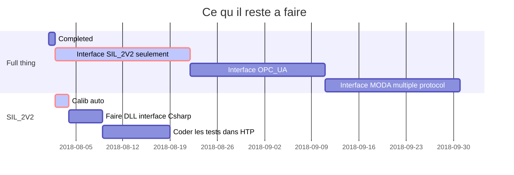
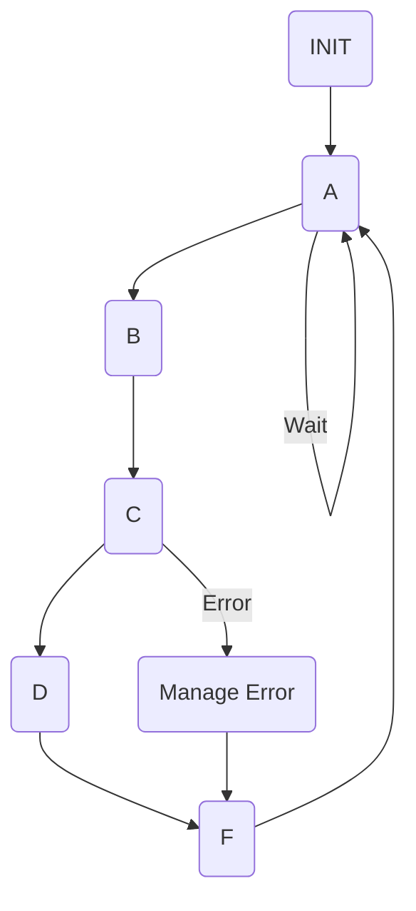

# Desc

Ce qu'il reste a faire pour la JIG.

## Gantt
Arranger les temps


## Files
Commentaire sur code actuel.
### main.cpp
avec autant de extern, ca va pas etre evident de faire l'intergration avec multi-protocol plus tard.
### command_r2.xpp
Beaucoup de redondance dans le code. Ca pourrait etre beaucoup plus simple egalement, car l'access registre est local. Example: une fonction comme **J1_Volt_Ref** pourrait etre ecrite de maniere beaucoup plus simple.
### calibration_r2.xpp
Pourquoi ca ete si long pour faire quelque chose de relativement simple, et deja code a 2 endroit, ou le code provenait preque tout du projet SIL2.
### afe_sil_2.xpp
Les tableau de voltage, leurs indexage et la gestion de polarity me semble compliqué.
### moda_sil_2.cpp
Mettre les tableaux de voltage dans registres ROM.
### r2Mediator.cpp
``` extern ns_DSSIL2_sil::R2ProtSilEthernet r2ProtSilEth; ``` Pourquoi un external ? Nous sommes dans un mediator. Pointeur devrait etre passé au INIT. C'est phisolophiquement deux affaires incompatible.
### r2Pca0010.cpp 
Beaucoup de repetitions et redondance, les fonctions sont toutes pareilles sauf pour le nom du registres. A optimiser. Il faut le minimum d'interface si on est pour caller les fonctions a partir d'un marshelling en Csharp, et il faut que ca soit general, pas specifique. Sinon, il va y avoir trop d'interface a definir, et il va falloir ajouter une interface pour cahque nouvelle fonction.
### Tout le code
Eviter les while !!!!


## State machine

Un diagram de chaque state machine serait requis, voici un example simple en markdown, meme principe qu'avec DOT dans Doxygen. S'assurer que chaque transition est couverte.



## Interface OPCUA
Je crois que ca vaut la peine pour avoir un seul interface de comm entre HTP et JIG. Va etre tres semblable a ce que Herve est en train de faire avec la IFOCOM OPCUA (un board UA, un bord r2 custom protocol).

## Interface MODA multiple protocol
Pour interface JIG-MODA multi-protocol, il va falloir trouver une maniere de gerer chacune des stack de communication de maniere decouplé du reste du code de la JIG. Il est peut-etre mieux de faire une load de JIG par protocol, et programmer la JIG (ou checker load actuelle) selon le protocol requis par le MODA.


## ewrewr

## rrrr


## fdgdgfdg
```

<details>
<summary></summary>
custom_mark10
  digraph G {
    size ="4,4";
    main [shape=box];
    main -> parse [weight=8];
    parse -> execute;
    main -> init [style=dotted];
    main -> cleanup;
    execute -> { make_string; printf};
    init -> make_string;
    edge [color=red];
    main -> printf [style=bold,label="100 times"];
    make_string [label="make a string"];
    node [shape=box,style=filled,color=".7 .3 1.0"];
    execute -> compare;
  }
custom_mark10
</details>
```
<!--stackedit_data:
eyJoaXN0b3J5IjpbLTExMzg4MjIzMDgsNzA3ODUyNzkwXX0=
-->